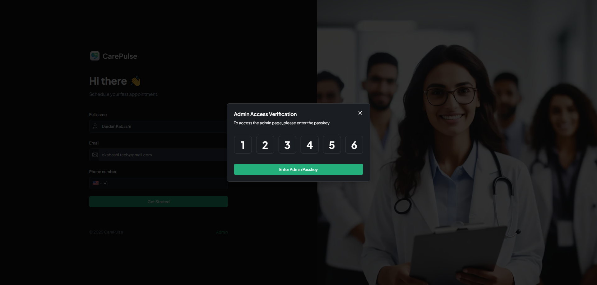
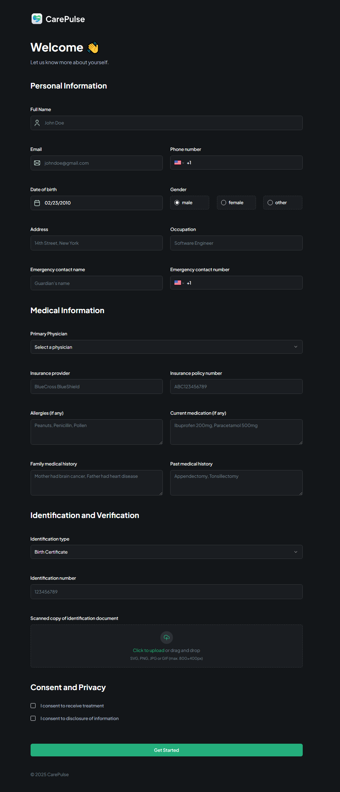
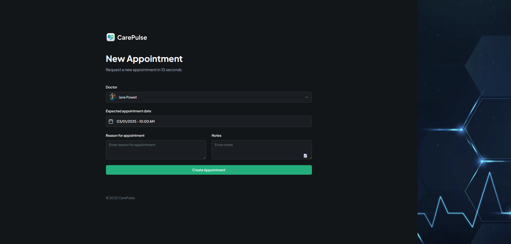
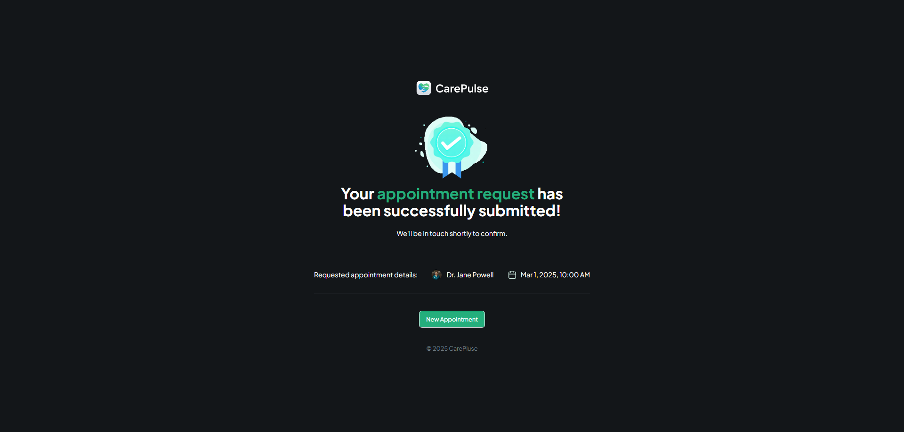
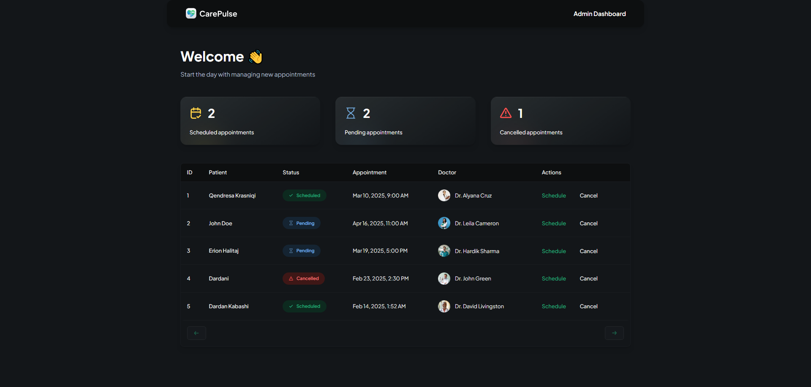
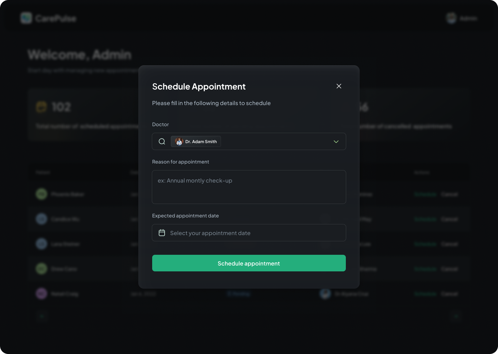
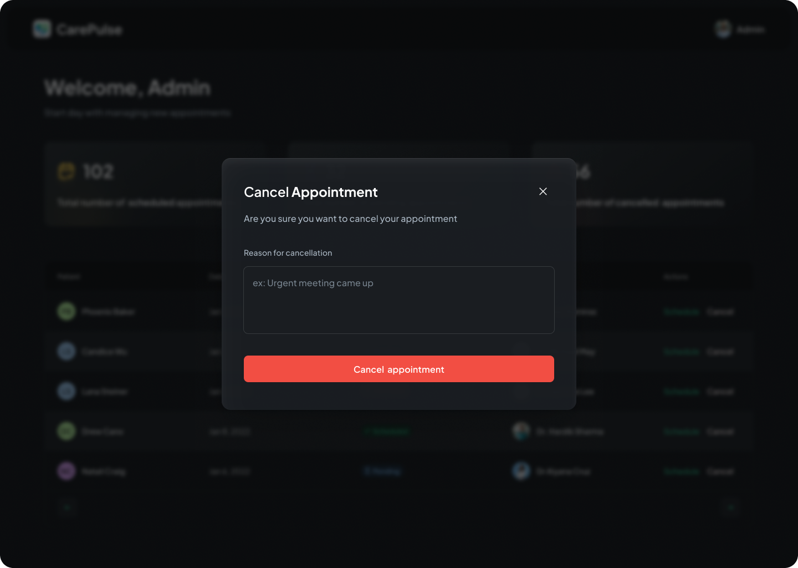
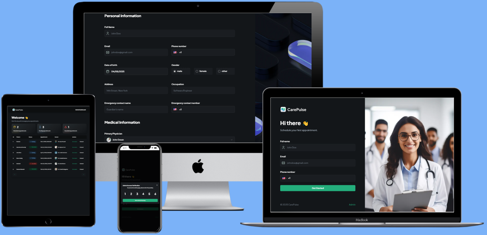

# 🏥 HealthDesk - Patient Management System

A modern, full-stack healthcare management platform designed to eliminate long hospital wait times and streamline the entire patient journey. From registration to appointment scheduling and real-time SMS confirmations, HealthDesk solves a real-world problem that affects millions of patients every day.

Built with **Next.js 14, TypeScript, Appwrite, and Twilio**, this application delivers a seamless experience for patients while giving healthcare administrators powerful tools to manage appointments efficiently.

**🔗 Live Demo:** [hospital-one-hazel.vercel.app](https://hospital-one-hazel.vercel.app)

**🔑 Admin Access Passkey:** `111111`  
To access the admin dashboard, click the "Admin" link at the bottom of the homepage and enter the passkey above.

---

## ✨ Features

✅ **Patient Registration with Multi-Step Forms** - Comprehensive medical history, identification verification, and consent management.  
✅ **Appointment Booking System** - Patients can schedule appointments with their preferred doctor, pick a date and time, and provide their reason for visit.  
✅ **Admin Dashboard with Passkey Protection** - OTP-based admin access with client-side session persistence and server-side validation.  
✅ **Real-Time SMS Notifications** - Automated appointment confirmations and cancellation alerts powered by Twilio and Appwrite Messaging.  
✅ **Dynamic Status Management** - Admins can schedule, confirm, or cancel appointments with cancellation reason tracking.  
✅ **Secure File Upload** - Patients can upload identification documents stored securely via Appwrite Storage.  
✅ **Error Monitoring & Performance Tracking** - Integrated Sentry for production-grade error tracking, session replays, and performance insights.  
✅ **Fully Responsive Design** - Optimized for desktop, tablet, and mobile with a clean, modern dark mode UI.  
✅ **Type-Safe Architecture** - End-to-end TypeScript with Zod validation for bulletproof data integrity.

---

## 🔥 Tech Stack

### 🖥️ Frontend
- **Next.js 14** (App Router, Server Actions, Server Components)
- **TypeScript** for complete type safety
- **Tailwind CSS** for rapid, utility-first styling
- **ShadCN UI** for accessible, reusable components
- **React Hook Form + Zod** for robust form validation
- **React Datepicker** and **React Phone Number Input** for complex input handling

### 🔧 Backend & Services
- **Appwrite Cloud** (Authentication, Database, Storage, Messaging)
- **Twilio** (SMS delivery infrastructure)
- **Sentry** (Error monitoring and session replay)
- **Node Appwrite SDK** for server-side operations

### 🚀 DevOps & Deployment
- **Vercel** (Production hosting with CI/CD)
- **GitHub** (Version control)

---

## 🎯 The Problem It Solves

Booking and managing doctor appointments is often slow and unclear. Patients don’t always know if their request went through, and administrators end up handling everything manually across different tools.

HealthDesk simplifies this process with a clear registration and booking flow, real-time SMS confirmations, and a centralized admin dashboard to manage appointments efficiently. The result is better visibility, fewer missed appointments, and a smoother experience for both patients and staff.

---

## 🏗️ Architecture Highlights

### 🔐 Security
- Admin passkey gate with client-side session persistence and server-side validation
- Server-side validation with Zod schemas on every form submission
- Environment-based credential management
- Appwrite role-based permissions for fine-grained access control

### ⚡ Performance Optimized
- Server Actions eliminate API route boilerplate
- Next.js Image component for automatic optimization
- Path revalidation for instant admin dashboard updates after mutations
- Minimal client-side JavaScript with strategic server component usage

### 🧩 Reusable Component Library
- Custom form field system supporting 8+ input types (text, phone, date picker, select, checkbox, file upload, text area, and radio skeleton)
- Reduces form code from hundreds of lines to under 20 per field
- Fully extensible with strong TypeScript typing

### 📊 Smart Data Pipeline
- Aggregation logic for appointment statistics (scheduled, pending, cancelled counts)
- Single-query data fetching for admin dashboard
- Automatic path revalidation after appointment updates

---

## 📸 Screenshots

### **Patient Registration**

### **Admin Access Verification**

### **Medical History Form**

### **Appointment Booking**

### **Confirmation Screen**

### **Admin Dashboard**

### **Schedule & Cancel Appointments**

### **Application Interface**

### **Multiple Devices view**

---

## 🚀 Why This Stands Out

HealthDesk is a production-grade application built with the same tools and patterns used by modern tech startups and enterprise engineering teams.

**What makes this project impressive:**

🔹 **Solves a real-world problem** that affects every person who has ever visited a hospital.  
🔹 **Full TypeScript coverage** from database schemas to React components.  
🔹 **Server Actions architecture** demonstrates understanding of the latest Next.js patterns.  
🔹 **Real SMS integration** via Twilio shows comfort with third-party APIs.  
🔹 **Production monitoring** via Sentry proves awareness of reliability concerns.  
🔹 **Complex forms done right** using a reusable field abstraction that scales to 20+ fields without code duplication.  
🔹 **Thoughtful UX details** like pre-filled default values when editing appointments, contextual button labels, and appropriate error messaging.

This project demonstrates full-stack proficiency, architectural thinking, and the ability to ship polished features that real users would actually rely on.

---

Built by **Dardan Kabashi**
